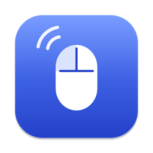

<div align="center">



# DoubleClick Fixer

**Fix a mouse that double-clicks when you click once.**<br>
A free, open-source app for Windows and macOS that stops mouse double-clicking caused by a worn switch. It filters the extra clicks (switch bounce, or "chatter") and leaves your real double-clicks alone.

[](https://github.com/arnav-goel10/doubleclick-fixer/releases/latest)
[](https://github.com/arnav-goel10/doubleclick-fixer/releases)
[](https://github.com/arnav-goel10/doubleclick-fixer/actions/workflows/ci.yml)
[%20%7C%20Windows%2010%2F11-lightgrey)](#download)
[](LICENSE)

**[Download for Mac](https://github.com/arnav-goel10/doubleclick-fixer/releases/latest/download/DoubleClickFixer.dmg)** &nbsp;·&nbsp;
**[Download for Windows](https://github.com/arnav-goel10/doubleclick-fixer/releases/latest/download/DoubleClickFixer-Setup.exe)** &nbsp;·&nbsp;
[All releases](https://github.com/arnav-goel10/doubleclick-fixer/releases)

</div>

<p align="center">
  
  
</p>
<p align="center"><sub>macOS &nbsp;·&nbsp; Windows 11</sub></p>

## The problem

Mouse buttons wear out. The metal contact inside starts to bounce, so a single click arrives twice. If your mouse does any of these, this is the app for it:

- it **double-clicks when you click once**: files open when you meant to select them, links open in two tabs;
- **drag and drop lets go** halfway, or text selection keeps restarting;
- a **held button seems to release on its own** while you drag a window or a file.

It happens to every brand sooner or later, Logitech, Razer, SteelSeries, Microsoft and others, and it's especially common on gaming mice. Replacing the switch fixes it for good; DoubleClick Fixer fixes it in software today, on Windows 10, Windows 11 and macOS.

## How it works

A bounce has a tell-tale signature: the extra press arrives a few milliseconds after the button was released, far faster than a finger can lift and press again. A deliberate double-click leaves 100 ms or more.

- **Clicks.** A press that comes within your filter window (typically 25–60 ms) of the last release is dropped, along with its release, so apps never see half a click.
- **Drags.** A worn switch can also lose contact for an instant while you hold it, which would end a drag. Once the button has been down for a moment, its release is held back for the filter window; if the contact comes straight back, the drag simply continues.
- **Your double-clicks are untouched.** Calibration measures your own double-click speed and keeps the filter well below it.

The filter works system-wide, at the same level as the mouse driver's own events, and all of it happens on your computer.

## Features

- **System-wide filtering** for the left, right and middle buttons, each one optional.
- **Calibration** that measures your mouse's bounce and your double-click speed, then recommends a setting.
- **Test pane** that shows every click's release-to-press gap, with bounces highlighted.
- **Native on both platforms:** a System Settings-style window and menu bar item on macOS, a Windows 11 Settings-style window and tray icon on Windows. Light and dark mode follow the system.
- **Runs quietly:** lives in the menu bar or notification area, opens at login if you want, and has no Dock icon while its window is closed.
- **Automatic updates** from this repository's releases, checksum-verified. On macOS they are signature-checked too, so your Accessibility permission carries over.

## Download

| Platform | Get it | Notes |
| --- | --- | --- |
| **macOS 13 or later** (Apple silicon) | [DoubleClickFixer.dmg](https://github.com/arnav-goel10/doubleclick-fixer/releases/latest/download/DoubleClickFixer.dmg) | Open it and drag DoubleClick Fixer onto Applications. |
| **Windows 10 or 11** | [DoubleClickFixer-Setup.exe](https://github.com/arnav-goel10/doubleclick-fixer/releases/latest/download/DoubleClickFixer-Setup.exe) | Or the [portable exe](https://github.com/arnav-goel10/doubleclick-fixer/releases/latest/download/DoubleClickFixer.exe), no installation needed. |

The builds are not yet signed with an Apple or Microsoft developer certificate, so the first launch needs one extra step:

- **macOS:** open the app once; macOS says it can't verify it. Go to **System Settings › Privacy & Security**, scroll down to the message about DoubleClick Fixer and choose **Open Anyway**. (On macOS 14 and earlier, right-click the app and choose **Open** instead.) Then allow DoubleClick Fixer under **Privacy & Security › Accessibility** when it asks; macOS only lets trusted apps filter input.
- **Windows:** if SmartScreen appears, choose **More info › Run anyway**.

Full instructions, including uninstalling: [docs/INSTALLATION.md](docs/INSTALLATION.md).

## Getting started

1. Open DoubleClick Fixer and choose **Calibrate** in the sidebar.
2. Click once at a time until it has counted twelve clicks, then double-click five times at your usual speed.
3. Apply the recommendation, and turn on **Bounce Filter**.

Close the window and the app keeps filtering from the menu bar or notification area. More detail in [docs/GETTING_STARTED.md](docs/GETTING_STARTED.md), and help in [docs/TROUBLESHOOTING.md](docs/TROUBLESHOOTING.md).

## FAQ

<details>
<summary><b>Will it block my real double-clicks?</b></summary>

No. It only drops a press that arrives within the filter window of the previous release, and calibration keeps that window at no more than half of your fastest measured double-click.
</details>

<details>
<summary><b>Does it add input lag?</b></summary>

Presses pass straight through. A release waits for the filter window (typically 25–60 ms) so a contact dropout can't end a drag; only the briefest taps skip that wait.
</details>

<details>
<summary><b>Why does it need Accessibility permission on macOS?</b></summary>

Blocking a click before other apps see it requires an event tap, and macOS only allows that for apps you have approved. The app cannot read keystrokes; it only listens to mouse buttons.
</details>

<details>
<summary><b>Does it send any data anywhere?</b></summary>

No. The only network request is the update check to this repository's GitHub releases, which you can turn off in **General**. No analytics, no accounts.
</details>

<details>
<summary><b>Will it get me flagged in games?</b></summary>

The app never invents a click, but it does re-send some: a release it held back for the filter window, and a press that arrives just as that window ends, reach apps as software input (on Windows, marked as injected). Most games don't care, but some anti-cheat systems watch for software-sent input; turn the filter off before playing those.
</details>

## Build from source

Python 3.11 or newer.

```bash
git clone https://github.com/arnav-goel10/doubleclick-fixer
cd doubleclick-fixer
python3 -m venv .venv && source .venv/bin/activate   # Windows: .\.venv\Scripts\Activate.ps1
pip install -r requirements.txt
python run.py
```

Run the tests with `python -m unittest discover -s tests`. Packaging and releases are covered in [docs/RELEASING.md](docs/RELEASING.md).

## Contributing

Bug reports and pull requests are welcome; start with [CONTRIBUTING.md](CONTRIBUTING.md). Please report security issues privately as described in [SECURITY.md](SECURITY.md).

## Support the project

DoubleClick Fixer is free. If it saved you from buying a new mouse, star the repository.

## Star history

[](https://star-history.com/#arnav-goel10/doubleclick-fixer&Date)

## License

[MIT](LICENSE) © 2026 Arnav Goel
