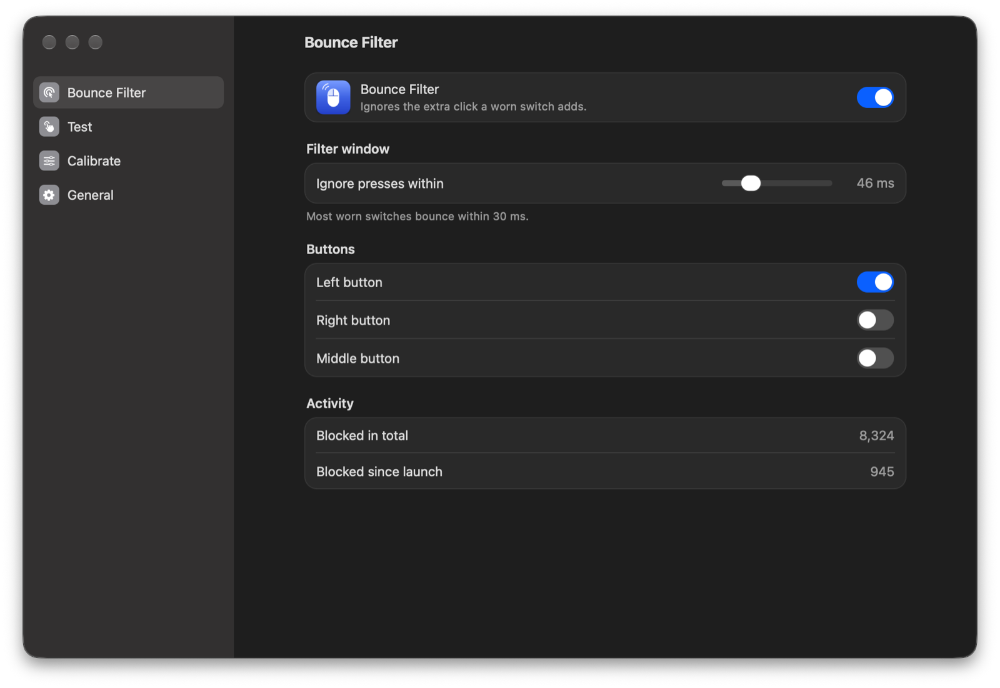
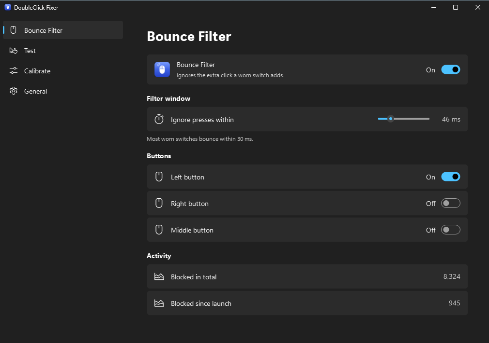

# DoubleClick Fixer

A desktop utility for a mouse that registers two clicks when you pressed once.
It measures the fault, learns a safe threshold, and filters the duplicate
system-wide on Windows and macOS — without disabling real double-clicks.

**[Download for Mac](https://github.com/arnav-goel10/doubleclick-fixer/releases/latest/download/DoubleClickFixer.dmg)** ·
**[Download for Windows](https://github.com/arnav-goel10/doubleclick-fixer/releases/latest/download/DoubleClickFixer-Setup.exe)** ·
[All releases](https://github.com/arnav-goel10/doubleclick-fixer/releases)

| macOS | Windows 11 |
| --- | --- |
|  |  |

## What switch bounce is

The metal contact inside a mouse button wears out. On release it vibrates, and
the controller reports a press the finger never made. The giveaway is *when*
that press arrives: a few milliseconds after the release, far faster than a
human can lift and press again.

DoubleClick Fixer therefore measures the gap **between a release and the next
press**, which is the same measurement mouse firmware calls debounce time. A
deliberate double-click leaves 100 ms or more in that gap; bounce is usually
under 30 ms. Filtering there removes the fault and leaves ordinary clicking,
double-clicking and dragging untouched.

## How it works

- **Native on both platforms** — a System Settings-style window on macOS
  (translucent sidebar, SF Symbols, your accent colour) and a Windows 11
  Settings-style window on Windows (Mica, Fluent icons, settings cards).
- **Test** — click the pad normally and watch each gap plotted against the
  current filter, so you can see the fault instead of guessing.
- **Calibration** — two labeled phases (single clicks, then double-clicks) that
  measure your bounce and your own double-click speed, then suggest a threshold
  that clears the first and stays well under the second.
- **System-wide filter** — a low-level mouse hook on Windows, a Core Graphics
  event tap on macOS. Rejected presses are dropped before any application sees
  them, and the matching release is dropped with them so no app ever receives
  half a click.
- **Menu bar / notification area** — the window closes to the tray and the
  filter keeps running. Quit from there to stop it.
- Left, right and middle buttons can be protected independently.

## Updates

The app keeps itself up to date from this repository's releases: it checks
shortly after launch and every six hours, verifies the download, installs it
and reopens, usually within a few seconds. On macOS, releases are always
signed with the same certificate, so the Accessibility permission carries
over and never has to be granted again. Turn automatic installs off in
**General › Software update** to update with **Check Now** instead.

## Install

- **macOS** — [DoubleClickFixer.dmg](https://github.com/arnav-goel10/doubleclick-fixer/releases/latest/download/DoubleClickFixer.dmg).
  Drag the app onto Applications, open it, and allow it under Accessibility
  when asked: macOS only lets a trusted app filter input.
- **Windows** — [DoubleClickFixer-Setup.exe](https://github.com/arnav-goel10/doubleclick-fixer/releases/latest/download/DoubleClickFixer-Setup.exe),
  or the portable [DoubleClickFixer.exe](https://github.com/arnav-goel10/doubleclick-fixer/releases/latest/download/DoubleClickFixer.exe).

See [docs/INSTALLATION.md](docs/INSTALLATION.md) for details and uninstall steps.

## Run from source

Python 3.11 or newer.

```bash
python -m venv .venv
source .venv/bin/activate        # Windows: .\.venv\Scripts\Activate.ps1
python -m pip install -r requirements.txt
python run.py
```

## Using it

1. Open the app and choose **Calibrate** in the sidebar. The system-wide
   filter pauses automatically so it can measure the raw mouse.
2. Step 1: click once, wait, repeat. Any extra press the mouse invents is
   recorded as bounce.
3. Step 2: double-click normally. This sets the limit the filter must never
   reach.
4. Apply the suggestion, then turn on **Bounce Filter**.

If bounce still gets through, raise the filter window slightly on the
**Bounce Filter** pane; if a
fast double-click ever gets swallowed, lower it. Values between 40 and 90 ms
suit most worn switches.

## Tests

```bash
python -m unittest discover -s tests -v
```

The suite covers the filter, calibration, settings migration and the window
(rendered offscreen). On Windows, CI additionally installs a real low-level
hook, injects clicks, and asserts through a second hook that bounce is blocked
while deliberate double-clicks survive.

## Packaging

```bash
bash installer/build_macos.sh       # DoubleClick Fixer.app + DMG
.\installer\build_windows.ps1       # portable exe; then compile installer\windows.iss
```

Pushing a `v*.*.*` tag builds both platforms and publishes a release.

More: [docs/TROUBLESHOOTING.md](docs/TROUBLESHOOTING.md) ·
[docs/DEMO.md](docs/DEMO.md) · [CONTRIBUTING.md](CONTRIBUTING.md) ·
[SECURITY.md](SECURITY.md) · [CHANGELOG.md](CHANGELOG.md)
